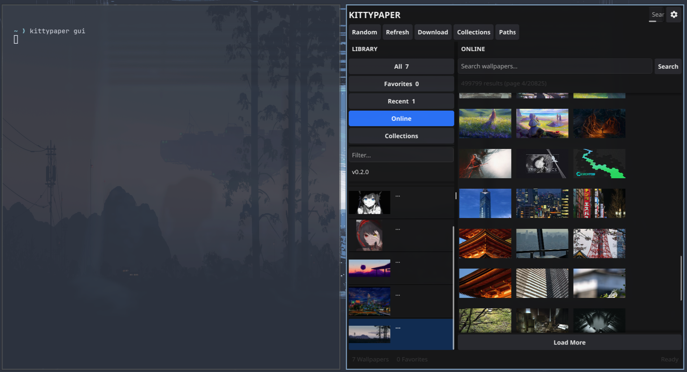
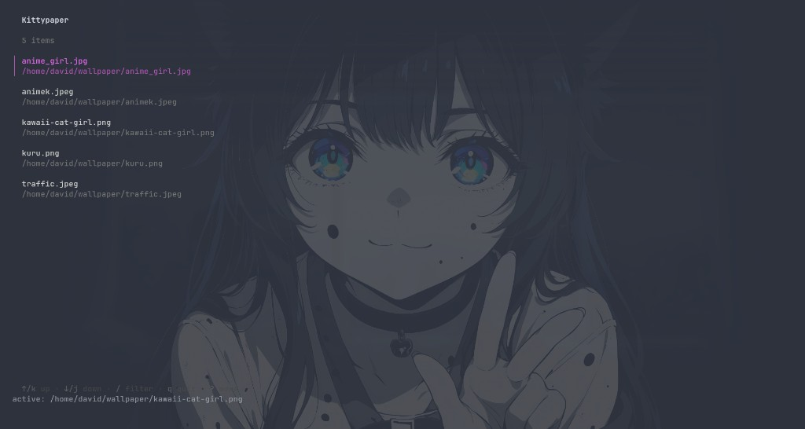

# Kittypaper

Wallpaper manager for the [Kitty](https://sw.kovidgoyal.net/kitty/) terminal.

Inspired by [Walt](https://github.com/gitfudge0/walt) (Hyprland wallpaper manager), but built only for Kitty. Kittypaper writes a separate `kittypaper-background.conf` and includes it from your `kitty.conf` — it **never overwrites** your main Kitty config.

## Screenshots

**GUI** — browse, preview, and apply wallpapers with tint/opacity controls:



**TUI** — fast terminal picker with filter and keyboard shortcuts:



---

## Features

- **CLI** — fast commands for scripts and daily use
- **TUI** — terminal wallpaper picker (Bubble Tea)
- **GUI** — desktop browser with preview (Walt-style layout)
- **Persistent wallpaper** — apply once, every new Kitty window keeps it (even after reboot)
- **Safe Kitty integration** — managed include file + automatic repair
- **Appearance controls** — `background_tint` and `background_opacity` from the GUI

---

## Requirements

| Requirement | Notes |
|-------------|-------|
| **Linux** | Primary target (Arch, Omarchy, etc.) |
| **Go 1.23+** | Only needed to build from source |
| **[Kitty](https://sw.kovidgoyal.net/kitty/)** | Tested with 0.46.x |
| **GUI build deps** | Arch: `sudo pacman -S gcc libxcursor libxrandr libxinerama libxi libglvnd mesa` |

---

## Installation

### 1. Clone the repository

```bash
git clone https://github.com/Creksz/kittypaper.git
cd kittypaper
```

### 2. Install the binary

```bash
make install
```

This builds and installs `kittypaper` to `~/.local/bin/kittypaper`.

### 3. Add to PATH (if needed)

Most Linux setups already include `~/.local/bin`. If `kittypaper` is not found:

```bash
echo 'export PATH="$HOME/.local/bin:$PATH"' >> ~/.bashrc
source ~/.bashrc
```

Verify:

```bash
kittypaper version
```

### Build without installing

```bash
make build
# binaries: bin/kittypaper, bin/kittypaper-tui, bin/kittypaper-gui
```

---

## First-time setup

Run these steps **once** after installation.

### Step 1 — Create your config

```bash
mkdir -p ~/.config/kittypaper
cp configs/example.kittypaper.yaml ~/.config/kittypaper/config.yaml
```

Edit `~/.config/kittypaper/config.yaml` and set your wallpaper folder:

```yaml
wallpaper_dirs:
  - "~/wallpaper"
  - "~/Pictures/Wallpapers"
```

### Step 2 — Wire Kitty

```bash
kittypaper init
```

This will:

- Create `~/.config/kitty/kittypaper-background.conf`
- Add `include /path/to/kittypaper-background.conf` to `kitty.conf` (append only)
- Restore your last wallpaper if one was saved before

### Step 3 — Pick a wallpaper

**GUI (recommended):**

```bash
kittypaper gui
```

**TUI:**

```bash
kittypaper tui
```

**CLI:**

```bash
kittypaper set ~/wallpaper/your-image.jpg
kittypaper random
```

---

## Daily usage

| Command | Description |
|---------|-------------|
| `kittypaper gui` | Open desktop wallpaper browser |
| `kittypaper tui` | Open terminal wallpaper picker |
| `kittypaper set PATH` | Apply a specific image |
| `kittypaper random` | Apply a random wallpaper |
| `kittypaper status` | Show active wallpaper and config state |
| `kittypaper restore` | Re-apply last saved wallpaper |
| `kittypaper init` | Setup / repair Kitty include |
| `kittypaper version` | Show version |

### GUI

- **Library** — browse and filter wallpapers
- **Preview** — resolution, modified date, live thumbnail
- **Paths** — add folders via file picker or typed path (Walt-style)
- **Appearance** — adjust `background_tint` (default `0.95`) and `background_opacity` (default `1.0`)
- **Apply / Random** — set wallpaper instantly

### TUI keys

| Key | Action |
|-----|--------|
| `Enter` | Apply selected wallpaper |
| `r` | Random |
| `/` | Filter list |
| `q` / `Esc` | Quit |

---

## How persistence works

When you **Apply** a wallpaper:

1. Kittypaper writes settings to `kittypaper-background.conf`
2. Your `kitty.conf` includes that file
3. **Every new Kitty window** reads it automatically — no need to run kittypaper again

You only need `kittypaper restore` if the generated file was deleted or corrupted.

---

## Configuration

Config file: `~/.config/kittypaper/config.yaml`

| Key | Default | Description |
|-----|---------|-------------|
| `kitty_conf_path` | `~/.config/kitty/kitty.conf` | Path to Kitty config |
| `generated_conf_path` | `~/.config/kitty/kittypaper-background.conf` | Generated wallpaper config |
| `reload_method` | `auto` | `auto`, `kitty-remote`, or `signal` |
| `background_tint` | `0.95` | Kitty background tint (0–1) |
| `background_opacity` | `1.0` | Kitty background opacity (0–1) |
| `wallpaper_dirs` | `~/Pictures/Wallpapers`, `~/wallpaper` | Folders to scan |
| `cache_dir` | `~/.cache/kittypaper` | Cache directory |
| `state_file` | `~/.local/state/kittypaper/state.json` | Last applied wallpaper |

Override config path:

```bash
kittypaper --config /path/to/config.yaml status
```

---

## Troubleshooting

### Wallpaper looks blank / plain after opening Kitty

- Lower `background_tint` in the GUI (values near `1.0` hide the image)
- Run `kittypaper init` to repair the Kitty include
- Close **all** Kitty windows, then open a fresh one

### Wallpaper not saved after reboot

Make sure `kitty.conf` contains:

```text
include /home/YOU/.config/kitty/kittypaper-background.conf
```

Run:

```bash
kittypaper status    # check include: true
kittypaper restore   # re-apply last wallpaper
```

### `kittypaper: command not found`

```bash
make install
echo 'export PATH="$HOME/.local/bin:$PATH"' >> ~/.bashrc
source ~/.bashrc
```

---

## Development

```bash
make build    # build to bin/
make fmt      # format code
make vet      # static analysis
```

See [docs/architecture.md](docs/architecture.md) for project design.

---

## Contributing

Bug reports, feature ideas, and pull requests are welcome.

See [CONTRIBUTING.md](CONTRIBUTING.md).

---

## License

MIT — see [LICENSE](LICENSE).
